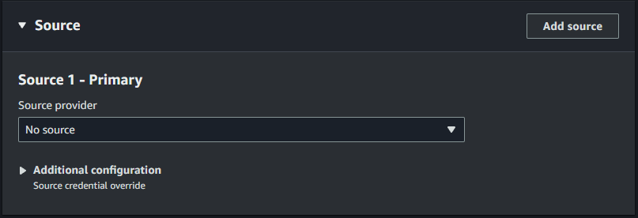
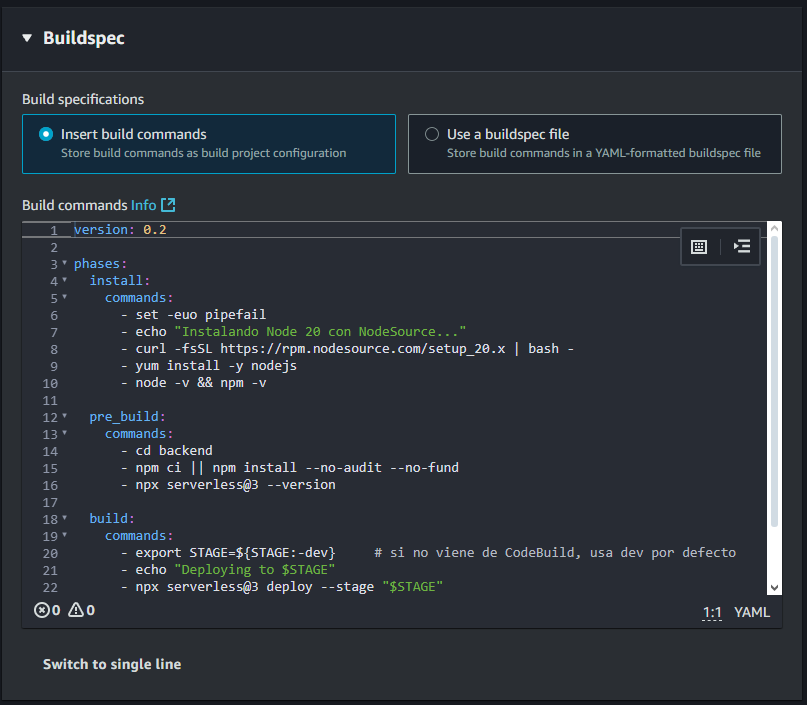
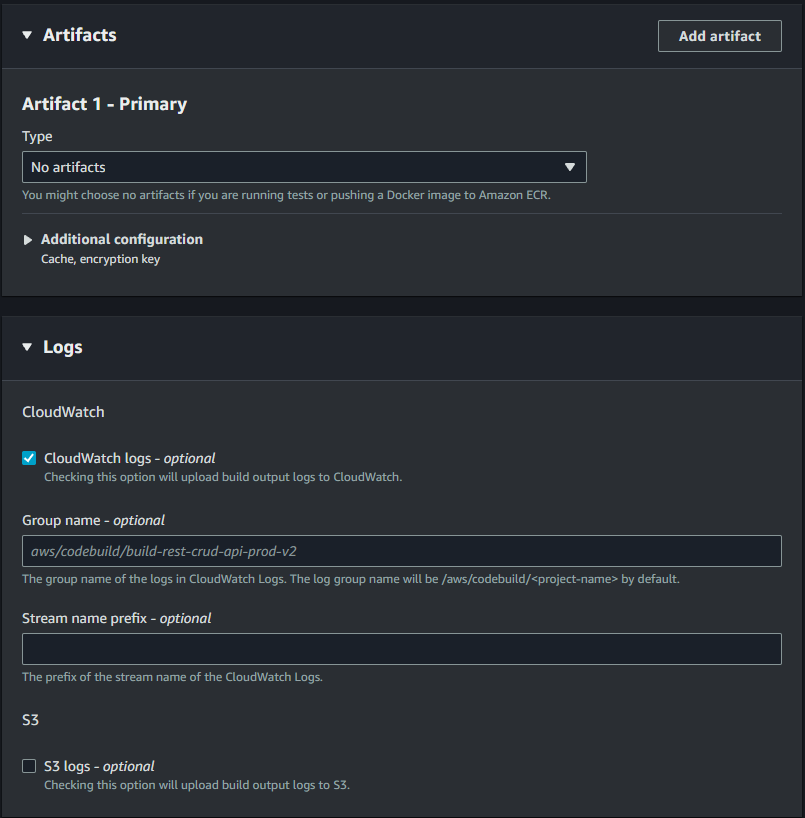

# REST CRUD Serverless en AWS (Node.js + React)

Backend con **Serverless Framework** (API Gateway + Lambda + DynamoDB) y frontend **React** (hosting en **Amplify**), con **CI/CD** en CodePipeline + CodeBuild para *multi-stage* (**dev/prod**) y despliegue automático por push a `main`.

---

## ✅ Entregables / Requisitos

- [x] Código **Node.js** (backend) y **React** (frontend)  
- [x] Infra automatizada con **Serverless Framework (IaC)**  
- [x] API REST de **API Gateway** persiste en **DynamoDB**  
- [x] **4–5 Lambdas**: create, get, list, update, delete (sin proxy directo de APIGW a DynamoDB)  
- [x] **CI/CD** multi-stage (dev/prod) con CodePipeline/CodeBuild (+ frontend Amplify Hosting)  
- [x] Template funcional y **documentado**  
- [x] Repositorio público con commits frecuentes  
- [x] **Capturas** de Source/Build/Artifacts/Variables (abajo)

---

## 🧱 Arquitectura

```mermaid
flowchart LR
  A[GitHub (main)] --> P[CodePipeline]

  subgraph Backend (AWS)
    direction TB
    G[API Gateway REST]
    L1[Lambda createItem]
    L2[Lambda getItem]
    L3[Lambda listItems]
    L4[Lambda updateItem]
    L5[Lambda deleteItem]
    D[(DynamoDB: ItemsTable-${stage})]

    G <--> L1
    G <--> L2
    G <--> L3
    G <--> L4
    G <--> L5

    L1 --> D
    L2 --> D
    L3 --> D
    L4 --> D
    L5 --> D
  end

  B1[Serverless deploy --stage dev] --> G
  B2[Serverless deploy --stage prod] --> G

  R[React App (Amplify)] <--> G
```

---

## 🖼️ Capturas (CodePipeline / CodeBuild / API / DynamoDB / Amplify)

> Las imágenes viven en `docs/`. Si cambias nombres, ajusta los paths.

### Pipeline

- Resumen pipeline  
  

- Última ejecución  
  

### CodeBuild – DEV

- Source  
  

- Buildspec  
  

- Environment  
  

- Artifacts & Logs  
  

### CodeBuild – PROD

- Source  
  

- Buildspec  
  

- Environment  
  

- Artifacts & Logs  
  

### API Gateway y DynamoDB

- API Gateway (recursos)  
  

- DynamoDB (tabla DEV)  
  

- DynamoDB (tabla PROD)  
  

### Amplify (hosting React)

- App (overview)  
  

- UI App  
  

---

## 📦 Backend (Serverless Framework)

### `backend/serverless.yml` (extracto)

```yml
service: rest-crud-api
frameworkVersion: '3'

provider:
  name: aws
  runtime: nodejs20.x
  region: us-east-1
  stage: ${opt:stage, 'dev'}
  environment:
    TABLE_NAME: ItemsTable-${self:provider.stage}
  iam:
    role:
      statements:
        - Effect: Allow
          Action:
            - dynamodb:PutItem
            - dynamodb:GetItem
            - dynamodb:Scan
            - dynamodb:UpdateItem
            - dynamodb:DeleteItem
          Resource:
            - arn:aws:dynamodb:${self:provider.region}:*:table/${self:provider.environment.TABLE_NAME}
  deploymentBucket:
    name: serverless-artifacts-678901075164-us-east-1
    blockPublicAccess: true

functions:
  createItem:
    handler: src/handler.createItem
    events:
      - http:
          path: items
          method: post
          cors: true

  getItem:
    handler: src/handler.getItem
    events:
      - http:
          path: items/{id}
          method: get
          cors: true

  listItems:
    handler: src/handler.listItems
    events:
      - http:
          path: items
          method: get
          cors: true

  updateItem:
    handler: src/handler.updateItem
    events:
      - http:
          path: items/{id}
          method: put
          cors: true

  deleteItem:
    handler: src/handler.deleteItem
    events:
      - http:
          path: items/{id}
          method: delete
          cors: true

resources:
  Resources:
    ItemsTable:
      Type: AWS::DynamoDB::Table
      Properties:
        TableName: ${self:provider.environment.TABLE_NAME}
        BillingMode: PAY_PER_REQUEST
        AttributeDefinitions:
          - AttributeName: id
            AttributeType: S
        KeySchema:
          - AttributeName: id
            KeyType: HASH
```

---

## 🏗️ CI/CD Backend – CodeBuild (`.aws/buildspec.yml`)

```yaml
version: 0.2

env:
  variables:
    STAGE: ${STAGE:-dev}

phases:
  install:
    commands:
      - node -v
      - npm -v

  pre_build:
    commands:
      - cd backend
      - if [ -f package-lock.json ]; then npm ci; else npm install --no-audit --no-fund; fi
      - npx serverless@3 --version

  build:
    commands:
      - echo "Deploying to ${STAGE}"
      - npx serverless@3 deploy --stage "${STAGE}"

  post_build:
    commands:
      - echo "Build completed on $(date)"
```

> `STAGE` lo inyecta CodeBuild/CodePipeline para desplegar `dev` o `prod`.

---

## 🎨 Frontend (React + Vite + Chakra UI, hosting en Amplify)

### Variable de entorno (build-time)

- `VITE_API_URL` → `https://<api_id>.execute-api.us-east-1.amazonaws.com/prod`

Se inyecta en Amplify a través de `amplify.yml` (monorepo con `appRoot: frontend`).

### `amplify.yml`

```yaml
version: 1
applications:
  - appRoot: frontend
    env:
      variables:
        VITE_API_URL: https://<api_id>.execute-api.us-east-1.amazonaws.com/prod
    frontend:
      phases:
        preBuild:
          commands:
            - npm ci || npm install
            - echo "VITE_API_URL=$VITE_API_URL"
        build:
          commands:
            - npm run build
      artifacts:
        baseDirectory: dist
        files:
          - '**/*'
      cache:
        paths:
          - node_modules/**/*
```

> Sustituye `<api_id>` por el ID real de tu API Gateway.

### `frontend/src/App.jsx` (extracto)

```jsx
import React, { useEffect, useState } from 'react'
import axios from 'axios'
import { Box, Container, Heading, Stack, Input, Button, SimpleGrid, Text, useToast } from '@chakra-ui/react'

const API_BASE = import.meta.env.VITE_API_URL
console.log('[APP] VITE_API_URL =', API_BASE)

export default function App() {
  const [items, setItems] = useState([])
  const [text, setText] = useState('')
  const toast = useToast()

  const load = async () => {
    const { data } = await axios.get(`${API_BASE}/items`)
    setItems(data)
  }

  useEffect(() => { load() }, [])

  const createItem = async () => {
    if (!text.trim()) return
    const { data } = await axios.post(`${API_BASE}/items`, { text })
    setText('')
    toast({ title: 'Creado', status: 'success', duration: 1500 })
    setItems(prev => [data, ...prev])
  }

  const updateItem = async (id) => {
    const val = prompt('Nuevo texto:')
    if (!val) return
    const { data } = await axios.put(`${API_BASE}/items/${id}`, { text: val })
    setItems(prev => prev.map(i => i.id === id ? data : i))
  }

  const deleteItem = async (id) => {
    await axios.delete(`${API_BASE}/items/${id}`)
    setItems(prev => prev.filter(i => i.id !== id))
  }

  return (
    <Container maxW="container.lg" py={10}>
      <Heading mb={6} textAlign="center">CRUD Serverless</Heading>

      <Stack direction={{ base: 'column', md: 'row' }} gap={3} mb={6}>
        <Input placeholder="Escribe algo..." value={text} onChange={e => setText(e.target.value)} />
        <Button onClick={createItem}>Agregar</Button>
      </Stack>

      <SimpleGrid columns={{ base: 1, sm: 2, lg: 3, xl: 4 }} spacing={4}>
        {items.map(it => (
          <Box key={it.id} p={4} borderWidth="1px" borderRadius="lg">
            <Text noOfLines={3}>{it.text}</Text>
            <Stack direction="row" mt={3}>
              <Button size="sm" onClick={() => updateItem(it.id)}>Editar</Button>
              <Button size="sm" onClick={() => deleteItem(it.id)} variant="outline">Borrar</Button>
            </Stack>
          </Box>
        ))}
      </SimpleGrid>
    </Container>
  )
}
```

---

## 🧪 Pruebas rápidas con `curl`

```bash
API="https://<api_id>.execute-api.us-east-1.amazonaws.com/prod"

# Crear
curl -i -X POST "$API/items"   -H 'Content-Type: application/json'   -d '{"text":"hola desde curl"}'

# Listar
curl -s "$API/items" | jq

# Obtener por id
curl -s "$API/items/<id>" | jq

# Actualizar
curl -i -X PUT "$API/items/<id>"   -H 'Content-Type: application/json'   -d '{"text":"actualizado"}'

# Eliminar
curl -i -X DELETE "$API/items/<id>"
```

---

## 🧹 Limpieza

```bash
# Backend
cd backend
npx serverless@3 remove --stage dev
npx serverless@3 remove --stage prod

# Frontend
# En AWS Amplify: App → Actions → Delete app
```

---

## 📂 Estructura (resumen)

```
.
├── .aws/
│   └── buildspec.yml
├── backend/
│   ├── src/handler.js ...
│   └── serverless.yml
├── frontend/
│   ├── src/App.jsx
│   ├── index.html
│   ├── package.json
│   └── vite.config.js
├── docs/
│   ├── pipeline-overview.png
│   ├── pipeline-execution-summary.png
│   ├── codebuild-dev-*.png
│   ├── codebuild-prod-*.png
│   ├── apigw-resources.png
│   ├── dynamodb-dev-table.png
│   ├── dynamodb-prod-table.png
│   ├── amplify-overview.png
│   └── app-ui.png
└── amplify.yml
```

---

## 📌 Notas

- **CORS** habilitado en endpoints HTTP de Serverless.  
- **Amplify** usa `amplify.yml` con `applications[0].appRoot=frontend` (monorepo).  
- **VITE_API_URL** debe apuntar a tu **API Gateway** (`/prod`).

